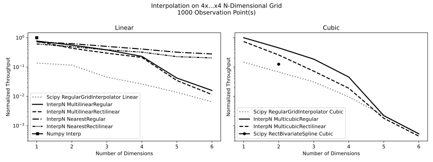

# Quickstart

[Docs](https://interpnpy.readthedocs.io/en/latest/) |
[Repo](https://github.com/jlogan03/interpnpy) |
[Rust Library (github)](https://github.com/jlogan03/interpn) |
[Rust Docs (docs.rs)](https://docs.rs/interpn/latest/interpn/)

This library provides serializable N-dimensional interpolators
backed by compute-heavy code written in Rust.

These methods perform zero allocation when evaluated (except, optionally, for the output).
Because of this, they have minimal per-call overhead, and are particularly
effective when examining small numbers of observation points. See the [performance](/perf) page for detailed benchmarks.

## Features
| Feature →<br>↓ Interpolant Method | Regular<br>Grid | Rectilinear<br>Grid | Json<br>Serialization |
|-----------------------------------|-----------------|---------------------|-----------------------|
| Linear                            |   ✅            |     ✅              | ✅                    |
| Cubic                             |   ✅            |     ✅              | ✅                    |

The methods provided here, while more limited in scope than scipy's,

* are significantly faster under most conditions
* use almost no RAM (and perform no heap allocations at all)
* produce significantly improved floating-point error (by several orders of magnitude)
* are json-serializable using Pydantic
* can also be used easily in web and embedded applications via the Rust library
* are permissively licensed



See [here](https://interpnpy.readthedocs.io/en/latest/perf/) for more info about quality-of-fit, throughput, and memory usage.

## Installation

```bash
pip install interpn
```

## Example: Available Methods

```python
import interpn
import numpy as np

# Build grid
x = np.linspace(0.0, 10.0, 5)
y = np.linspace(20.0, 30.0, 4)
grids = [x, y]

xgrid, ygrid = np.meshgrid(x, y, indexing="ij")
zgrid = (xgrid + 2.0 * ygrid)  # Values at grid points

# Grid inputs for true regular grid
dims = [x.size, y.size]
starts = np.array([x[0], y[0]])
steps = np.array([x[1] - x[0], y[1] - y[0]])

# Initialize different interpolators
# Call like `linear_regular.eval([xs, ys])`
linear_regular = interpn.MultilinearRegular.new(dims, starts, steps, zgrid)
cubic_regular = interpn.MulticubicRegular.new(dims, starts, steps, zgrid)
linear_rectilinear = interpn.MultilinearRectilinear.new(grids, zgrid)
cubic_rectilinear = interpn.MulticubicRectilinear.new(grids, zgrid)
```

## Example: Multilinear Interpolation on a Regular Grid

```python
import interpn
import numpy as np

# Build grid
x = np.linspace(0.0, 10.0, 5)
y = np.linspace(20.0, 30.0, 4)

xgrid, ygrid = np.meshgrid(x, y, indexing="ij")
zgrid = (xgrid + 2.0 * ygrid)  # Values at grid points

# Grid inputs for true regular grid
dims = [x.size, y.size]
starts = np.array([x[0], y[0]])
steps = np.array([x[1] - x[0], y[1] - y[0]])

# Observation points pointed back at the grid
obs = [xgrid.flatten(), ygrid.flatten()]

# Initialize
interpolator = interpn.MultilinearRegular.new(dims, starts, steps, zgrid)

# Interpolate
out = interpolator.eval(obs)

# Check result
assert np.allclose(out, zgrid.flatten(), rtol=1e-13)

# Serialize and deserialize
roundtrip_interpolator = interpn.MultilinearRegular.model_validate_json(
    interpolator.model_dump_json()
)
out2 = roundtrip_interpolator.eval(obs)

# Check result from roundtrip serialized/deserialized interpolator
assert np.all(out == out2)
```

# License

Licensed under either of

- Apache License, Version 2.0, ([LICENSE-APACHE](LICENSE-APACHE) or http://www.apache.org/licenses/LICENSE-2.0)
- MIT license ([LICENSE-MIT](LICENSE-MIT) or http://opensource.org/licenses/MIT)

at your option.
