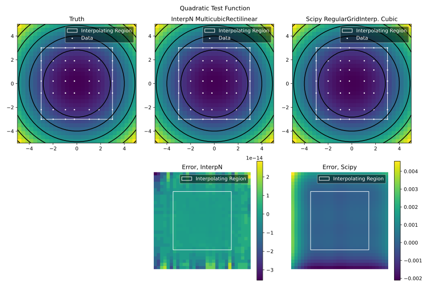
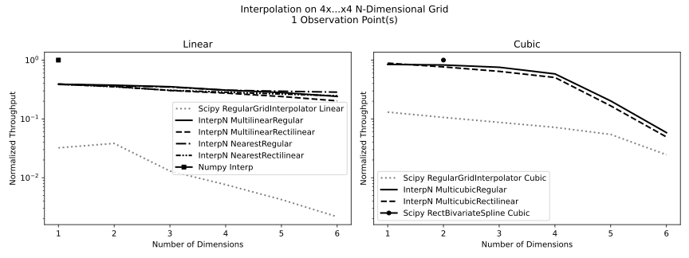

# Performance

## Quality-of-Fit

The cubic Hermite interpolation method used in InterpN is slightly different from a B-spline, which is part of what allows it to achieve higher throughput.

This fit method, which uses first derivative BCs at each grid point on the interior region and a "natural spline" (zero third derivative) at the grid edges, also produces a similar-or-better quality fit by most metrics. This method prioritizes correctness of values and first derivatives over maintaining a continuous second derivative.

The linear methods' quality of fit, being linear, is not very interesting.

### 1D Cubic Interpolation & Extrapolation
InterpN shows significantly improvements in both numerical error and quality-of-fit, especially where sharp changes or strong higher derivatives are present. 

### 2D Cubic Interpolation & Extrapolation
Both InterpN and Scipy methods can full capture a quadratic function in arbitrary dimensions, including under extrapolation. However, InterpN produces several orders of magnitude less floating point error, despite requiring significantly less run time.

----
## Throughput

InterpN methods are quite fast.

More commentary about low-level perf scalings for each method
can be found in the [documentation for the Rust library](https://docs.rs/interpn/latest/).

----
### Throughput vs. Dimensionality
Specialized methods (Scipy `RectBivariateSpline` and numpy `interp`), while not N-dimensional methods,
are shown to highlight that InterpN achieves parity even with specialized low-dimensional methods,
despite not specifically handling low-dimensional special cases.

#### 1 Observation Point

#### 1000 Observation Points

### 3D Throughput vs. Input Size
Evaluating points in large batches is substantially faster than one-at-a-time for all tested methods.

----
## Memory Usage

Memory profiling in Python is an odd activity. `memory_profiler` is used here, and may miss some memory usage in extension libraries. Also for this reason, the memory profiler is unable to capture the memory used by scipy to actualize the spline knots during initialization, and a comparison of profiled memory usage during initialization is unenlightening.

Since InterpN's backend library does not have access to an allocator, it's unlikely that there is much hidden behind that interface during evaluation. However, it is possible that some memory used by scipy is not identified by the profiler.

The linear methods all use roughly the same amount of RAM during evaluation. In the case of InterpN, as designed, the instantaneous memory usage of all the methods, both linear and cubic, is the same during evaluation.

The memory profiler picks up a large amount of RAM that is not actually part of the function evaluation, but belongs to the outer process. As a result, all methods show a bogus memory usage floor of about 97MB.

----
## Profile-Guided Optimisation

You can rebuild the Python extension with profile-guided optimisation enabled by running `python scripts/run_pgo.py`. The helper relies on `cargo-pgo` (install it with `cargo install cargo-pgo`) and executes `scripts/profile_workload.py`, which exercises each InterpN method for 1 and 1000 observation points across 1–8 dimensions to gather representative profiles, before merging the resulting `.profraw` files and copying the optimised library back into the package. Use `--bench test/bench_cpu.py` to run the comprehensive SciPy-based benchmark instead, and install the optional benchmarking dependencies first with `uv pip install '.[bench]'` if you need that workload.
